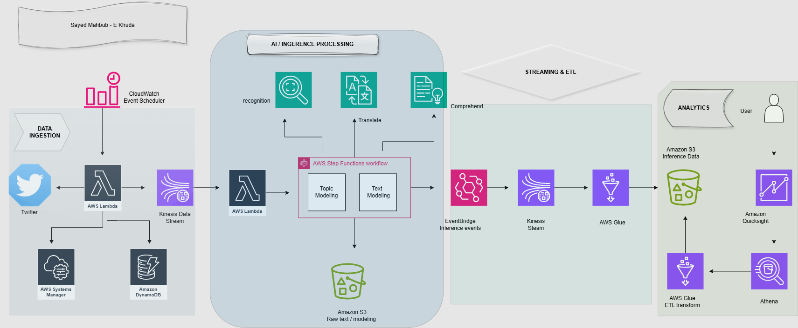

# AWS Streaming Data Architecture – Detailed Explanation

This document provides a detailed explanation of the AWS streaming data architecture, including the purpose of each AWS service and how data moves through the different pipelines.

## Architecture Diagram

---

## 1. Data Ingestion Pipeline

### Flow

CloudWatch Event Scheduler → Lambda Producer → External API

Lambda Producer → Kinesis Data Stream → Lambda Consumer

### CloudWatch Event Scheduler

CloudWatch Event Scheduler triggers the Lambda producer at a scheduled time or interval. This allows the data ingestion process to run automatically without requiring manual intervention.

### AWS Lambda – Producer

The Lambda producer is responsible for starting the data ingestion process.

It makes an API request to the external data source to retrieve new data.

The arrow in the architecture points:

Lambda → External API

This represents the API request made by Lambda. The requested data is then returned to Lambda for further processing.

After receiving the data, Lambda publishes the records to Amazon Kinesis Data Streams.

### AWS Systems Manager

AWS Systems Manager can be used to manage configuration information required by the Lambda function.

### Amazon DynamoDB

DynamoDB can be used to store information related to the ingestion process, such as processing state, metadata or the latest processed record.

### Amazon Kinesis Data Streams

Kinesis provides the streaming layer of the architecture.

The producer sends records to the Kinesis stream, allowing incoming data to be handled continuously.

### AWS Lambda – Consumer

The Lambda consumer receives records from Kinesis and prepares them for the next processing stage.

The main ingestion flow is therefore:

Lambda Producer → Kinesis Data Stream → Lambda Consumer

---

## 2. AI / Inference Processing Pipeline

### Flow

Lambda Consumer → AWS Step Functions

AWS Step Functions → Amazon Rekognition / Amazon Translate / Amazon Comprehend

### AWS Step Functions

AWS Step Functions acts as the workflow orchestration service.

Instead of putting all processing logic into a single Lambda function, Step Functions can coordinate multiple processing tasks and AWS services.

The architecture contains workflows for topic modelling and text inference.

### Amazon Rekognition

Amazon Rekognition can analyse images and video content and identify objects, text and other visual information.

### Amazon Translate

Amazon Translate can translate text between supported languages before further analysis.

### Amazon Comprehend

Amazon Comprehend provides Natural Language Processing capabilities.

It can analyse textual information such as sentiment, entities and key phrases.

### Amazon S3 – Raw Data

Amazon S3 is used to store raw data required for processing and topic modelling.

Keeping the raw data provides a historical source that can be processed again if required.

---

## 3. Processed Data / ETL Pipeline

### Flow

AWS Step Functions → Amazon EventBridge → Amazon Kinesis Data Streams → AWS Glue → Amazon S3

### Amazon EventBridge

After the inference process, EventBridge is used to publish processing or inference events.

These events can then be passed to downstream services.

### Amazon Kinesis Data Streams

A second Kinesis stream handles the processed/inference events.

This separates the incoming raw-data stream from the processed-data stream.

### AWS Glue

AWS Glue performs ETL processing.

ETL stands for:

- Extract
- Transform
- Load

Glue can clean, transform and prepare streaming data before it is stored for analytics.

### Amazon S3 – Inference Data

The transformed inference data is stored in Amazon S3.

S3 therefore acts as the main storage layer for the analytical data.

The processed-data pipeline is:

Step Functions → EventBridge → Kinesis → Glue → S3

---

## 4. Analytics Pipeline

The analytics side of the architecture allows users to interact with the processed data.

### Request Flow

User → Amazon QuickSight → Amazon Athena → AWS Glue / Amazon S3

The arrows on this side can be understood as the analytics or query request moving towards the stored data.

### Data / Result Flow

The results effectively return in the opposite direction:

Amazon S3 → Amazon Athena → Amazon QuickSight → User

### AWS Glue

AWS Glue can transform and prepare the stored data and provide metadata/schema information required for analytics.

### Amazon Athena

Amazon Athena allows SQL queries to be performed against data stored in Amazon S3.

This makes it possible to analyse S3 data without managing a traditional database server.

### Amazon QuickSight

Amazon QuickSight is the visualisation and Business Intelligence layer.

It can use analytical results to create dashboards, reports and visualisations for end users.

### User

The user interacts with the QuickSight dashboard to view and analyse the final information.

---

## Complete Architecture Flow

The main data-processing pipeline is:

External Source → Lambda → Kinesis → Lambda → Step Functions → EventBridge → Kinesis → Glue → S3

The analytics layer then uses the processed data:

S3 → Athena → QuickSight → User

---

## Key Concepts Demonstrated

This architecture demonstrates several important AWS data engineering concepts:

- Serverless data ingestion
- API-based data collection
- Real-time data streaming
- Producer and consumer architecture
- Workflow orchestration
- AI and Natural Language Processing
- Event-driven architecture
- ETL processing
- Data storage using Amazon S3
- SQL analytics using Amazon Athena
- Business Intelligence and dashboard visualisation
